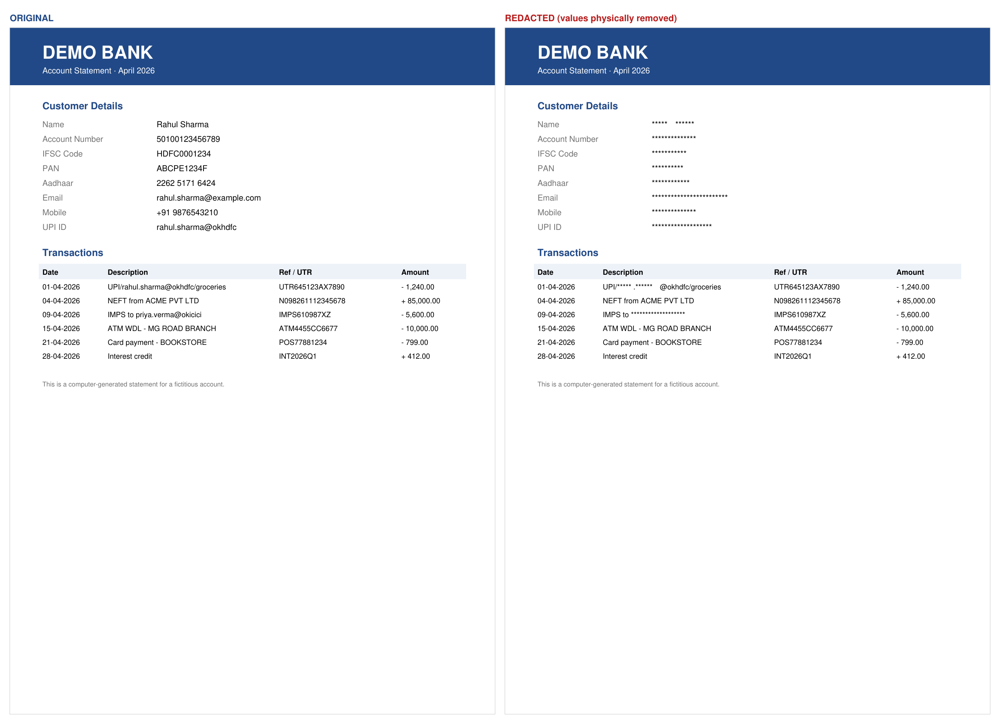
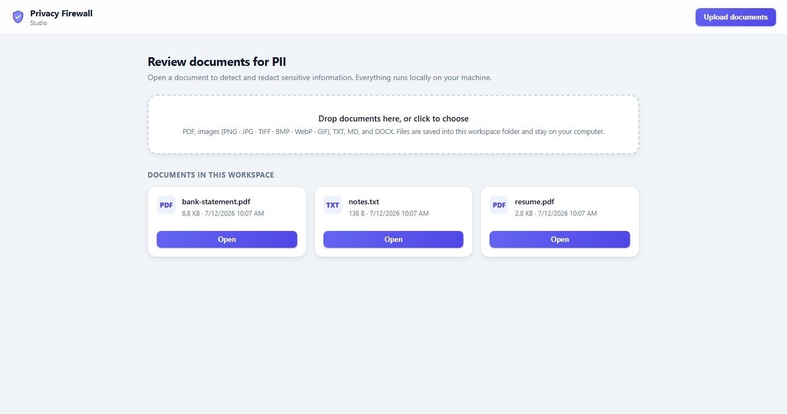
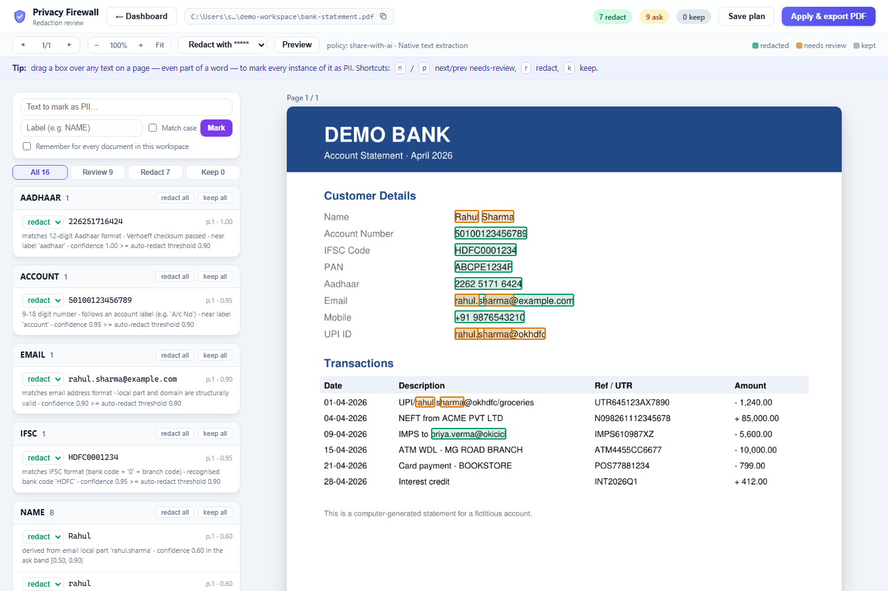

# Privacy Firewall

**Offline-first PII detection & redaction for documents.**

Detect and physically remove sensitive information from PDFs, images, and text documents — entirely on your machine. No cloud, no API keys, no telemetry. The web UI binds to `127.0.0.1` only; nothing ever leaves your computer.



*All values in the screenshots are synthetic — the account, PAN, Aadhaar, and person are fictitious.*

## Highlights

- **9 detectors** — PAN, Aadhaar, Email, Phone, UPI, IFSC, Account Number, GSTIN, and person Names (corroborated from email handles and profile slugs)
- **True redaction** — matched text is stripped from the PDF content stream via redaction annotations, not just painted over; copy-paste and text extraction find nothing
- **Verifiable redaction** — `--certificate` re-parses the output, proves none of the redacted values are still extractable, and emits an audit certificate (input/output hashes, counts by type, PASS/FAIL) that contains no raw PII
- **Batch mode** — `redact-batch` redacts a whole folder in one run and writes a CSV/JSON summary; originals are never touched
- **Review Studio** — a local web UI to review every detection, see *why* it matched, drag-select anything the detectors missed (even part of a word), and export
- **Workspace memory** — mark a term once with "remember", and it's flagged in every document in the workspace
- **Evidence & confidence** — every detection carries the matched text, location, a confidence score, and a human-readable reason
- **OCR for scans** — RapidOCR / Tesseract / PaddleOCR backends with automatic native-vs-OCR-vs-hybrid pipeline selection
- **Multi-format** — PDFs natively; images (PNG, JPG, TIFF, BMP, WebP, GIF), TXT, MD, and DOCX are converted on upload
- **Deterministic engine** — regex + validators (Verhoeff, structural checks) before any AI; fully offline, reproducible, and benchmarked at 100 % precision/recall on the bundled synthetic corpus

## Installation

### Desktop app (no Python needed)

Download the installer for your platform from the
[latest release](https://github.com/SurajSongara/privacy-firewall-starter-kit/releases):

| Platform | File | Notes |
|---|---|---|
| Windows | `PrivacyFirewall-Setup-<version>.exe` | Installs per-user; no admin rights required |
| macOS | `PrivacyFirewall-<version>.dmg` | Drag to Applications |
| Linux | `PrivacyFirewall-<version>-linux-x86_64.tar.gz` | Extract and run `./PrivacyFirewall` |

Everything is bundled — Python, the PDF engine, and OCR for scanned documents.
Launching the app opens the Studio dashboard in your browser on a
`PrivacyFirewall` folder inside your Documents. The same binary is also a full
CLI: `PrivacyFirewall detect statement.pdf`.

> The installers are currently **unsigned**, so Windows SmartScreen shows an
> "unrecognised app" warning and macOS Gatekeeper requires right-click → Open.

### From source

Requires **Python ≥ 3.12**.

```bash
git clone https://github.com/SurajSongara/privacy-firewall-starter-kit.git
cd privacy-firewall-starter-kit
pip install -e ".[ui,ocr-lite]"
```

| Extra | What it adds |
|---|---|
| `ui` | The review Studio web UI (FastAPI + uvicorn) |
| `ocr-lite` | **Recommended OCR backend** — RapidOCR via ONNX Runtime: pure wheels, models bundled, no system binary |
| `ocr` | PaddleOCR backend (needs `paddlepaddle`, which has no Python 3.14 wheel yet) |
| `docx` | DOCX upload support |
| `dev` | pytest, ruff, mypy, pre-commit |

Tesseract is also supported if you have `tesserocr` and a tessdata directory installed.

## Quick start — Studio (web UI)

```bash
# Launch the Studio dashboard on a folder of documents
python -m privacy_firewall --workspace ~/Documents/statements

# Or review a single file
python -m privacy_firewall review statement.pdf
```

Your browser opens a local dashboard listing every document in the workspace. Drop new files onto it (PDF, images, TXT, MD, DOCX) — they're saved into the workspace folder and stay on your computer.



Open a document to review what was found:



In the review screen you can:

- **Triage** — every detection shows its evidence and reason; toggle redact/keep per item or per type, with keyboard shortcuts (`n`/`p` to jump between items needing review, `r` redact, `k` keep)
- **Mark anything** — drag a box over any text on the page (even part of a word) or type a term in the sidebar to mark every instance in the document
- **Remember terms** — tick *"Remember for every document in this workspace"* and the term is flagged in every other document, now and later
- **Preview** — see exactly what the exported PDF will look like before committing
- **Apply & export** — writes a `.redacted.pdf` next to the original; the review plan is saved as JSON alongside it

## Quick start — CLI

```bash
# Show document structure
python -m privacy_firewall scan statement.pdf

# List all PII detections with evidence and confidence
python -m privacy_firewall detect statement.pdf

# Produce a redacted copy (values-only by default: labels stay, values go)
python -m privacy_firewall redact statement.pdf statement.redacted.pdf

# Redact and prove it: writes <out>.certificate.{json,pdf}, exits non-zero on leak
python -m privacy_firewall redact statement.pdf out.pdf --certificate

# Redact a whole folder in one run, with a CSV/JSON summary
python -m privacy_firewall redact-batch ./client-docs --out ./redacted --certificate

# Redaction styles: replace (***), black-bar, or highlight
python -m privacy_firewall redact statement.pdf out.pdf --type black-bar

# Scanned document? Force OCR, or let diagnostics decide
python -m privacy_firewall detect scan.pdf --ocr
python -m privacy_firewall detect scan.pdf --auto

# Health report: text quality, layout, OCR recommendation
python -m privacy_firewall doctor statement.pdf
```

Common flags:

| Flag | Commands | Effect |
|---|---|---|
| `--ocr` / `--auto` | scan, detect, redact, redact-batch, review | Force OCR, or let diagnostics pick native/OCR/hybrid |
| `--ocr-engine <name>` | scan, detect, redact, redact-batch, review | Pick a specific engine: `rapidocr`, `tesseract`, `paddleocr` |
| `--values-only` / `--full-block` | redact, redact-batch | Redact just the PII value vs. the whole text block |
| `--type <style>` | redact, redact-batch | `replace`, `black-bar`, or `highlight` |
| `--certificate` | redact, redact-batch | Verify the output and write an audit certificate |
| `--out <dir>` | redact-batch | Write redacted copies into a separate folder |
| `--password <pw>` | scan, detect, redact, redact-batch, doctor, review | Open a password-protected (encrypted) PDF |
| `--detector <name>` | detect | Run a single detector |

Password-protected PDFs are supported everywhere: pass `--password` on the CLI (or omit it and you'll be prompted securely), and in Studio you'll get an unlock prompt when you open an encrypted document. The password is held in memory only, and the redacted output is written **unencrypted** so it can be shared.

The default OCR engine is chosen deterministically: the `PRIVACY_FIREWALL_OCR_ENGINE` environment variable wins, otherwise the first *available* engine in the order `rapidocr > tesseract > paddleocr`.

## How it works

```
PDFParser ──► OCRProvider (optional) ──► HybridMerger ──► Detectors (9)
                                                              │
   new PDF ◄── PDFRenderer ◄── RedactionPlanner ◄── DecisionEngine ◄── FusionEngine
     │
     └──► Verifier (re-parse output, assert no leak) ──► Certificate
```

- Each stage exchanges immutable Pydantic v2 models — the engine has zero framework dependencies, and the CLI/UI are thin wrappers around it.
- Detectors are pure functions `(Document) → list[Detection]`, individually testable, with priority tiers (`regex > validator > heuristic > ner > llm`) used by the fusion engine to resolve overlaps.
- A context scorer adjusts confidence using the surrounding line (e.g. a 10-digit number on a line mentioning *UTR* is not a phone number), and a policy maps confidence to *redact / ask / keep* suggestions.
- Redaction uses PyMuPDF's `apply_redactions()` — the text is removed from the content stream. The original file is never modified; output always goes to a new path.

## Project structure

```
src/privacy_firewall/
├── __main__.py        # Typer CLI (studio is the default command)
├── cli/               # One file per subcommand — zero business logic
├── models/            # Frozen Pydantic v2 models (Document, Detection, …)
├── parsers/           # PyMuPDF PDF parser
├── ocr/               # OCR provider registry + Tesseract/Paddle/RapidOCR adapters
├── detectors/         # 9 detectors + registry + dedup utilities
├── engine/            # Context scoring, fusion, decision, redaction planning
├── diagnostics/       # Text-quality analysis + pipeline recommendation
├── layout/            # Header/footer/paragraph classification
├── bank_profiler/     # Per-bank statement profiles (SBI, HDFC, ICICI, Axis)
├── renderer/          # Destructive PDF renderer
└── ui/                # Review Studio (FastAPI, localhost only)

benchmarks/            # Precision benchmark vs. golden synthetic corpus
examples/synthetic/    # Golden dataset (all values fabricated)
tests/                 # 657 tests (pytest)
```

## Development

```bash
pip install -e ".[dev,ui]"
pytest                      # full suite
ruff check src/ tests/      # lint
mypy src/                   # strict type-checking
python -m benchmarks.precision   # precision/recall vs. the golden corpus
```

## Privacy

This tool exists to keep your documents private, and it practices what it preaches: no network calls, no telemetry, no cloud OCR. The web UI binds to `127.0.0.1` only. Everything — parsing, OCR, detection, redaction — runs locally.

## License

[GNU AGPL-3.0](LICENSE). The redaction engine links [PyMuPDF](https://pymupdf.readthedocs.io/), which is AGPL-licensed, so this project is too — if you distribute it (including as a hosted service or a packaged binary), you must make the corresponding source available. Build and packaging details are in [`packaging/README.md`](packaging/README.md).
